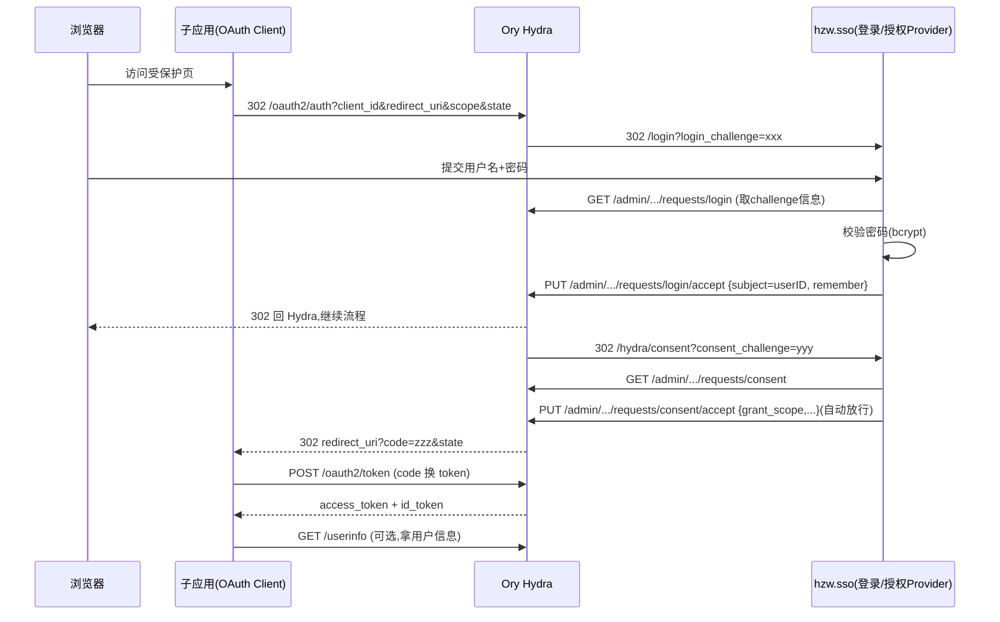

# 开源 SSO 单点登录系统 — 方案设计

> 状态:待评审
> 参照对象:`3d66.core-api` 的 `internal/sso` 模块(仅借鉴架构骨架与 Hydra 对接协议,不含任何公司专有代码/密钥/域名)
> 目标仓库:`hzw.sso`(单仓库,前后端同仓)

---

## 一、项目定位

一句话:**基于 Ory Hydra 的 OAuth2 / OIDC 统一单点登录服务**,Go 实现,DDD 分层架构,单仓库内嵌极简登录/授权页,`git clone` + `docker compose up` 即可跑通完整单点登录演示。

- **身份提供方(IdP)**:本项目负责「用户认证 + 登录/授权 UI」
- **OAuth2 授权服务器**:交给 Ory Hydra,令牌签发/校验/JWKS 全部由 Hydra 负责
- **登录方式**:用户名 + 密码(bcrypt),替代原项目的钉钉扫码
- **面向对象**:想要一套「拿来即用、零专有依赖」的自建 SSO 的开发者

### 为什么是「Hydra 做授权服务器 + 自建登录 UI」这种分工?

这是 Ory Hydra 官方推荐的标准集成模式:Hydra 只做 OAuth2/OIDC 协议引擎(**它不存用户、不管密码**),把「谁在登录」这件事通过 **Login & Consent Flow** 回调给我们自建的服务(官方称 Login/Consent Provider)。
依据:Ory 官方文档 *"Ory Hydra is not an identity provider... you need to implement the login and consent flow"*(https://www.ory.sh/docs/hydra/concepts/login )。这样职责清晰:协议安全性由成熟的 Hydra 保证,业务身份逻辑我们自己掌控。

---

## 二、与参照项目的关系(开源合规)

**只借鉴两样东西**:① DDD 分层骨架;② Hydra Admin API 的对接协议流程。
**逐项剔除的公司专有内容**:

| 剔除项 | 原位置 | 开源版替代 |
|--------|--------|-----------|
| 钉钉登录 | `iam/infrastructure/dingtalk_*`、`auth_service.DingtalkLogin` | 用户名密码登录 |
| 钉钉专属字段 | `User.DingUnionID` / `DingUserID` / `IsThirdParty` | 删除 |
| `sso-admin` OAuth 回环 | `pkg/auth.SSOClient`、`AdminCallback`、`AdminAuthorizeURL` | SSO 自签 JWT 管理态(见 §六) |
| 硬编码公司信息 | `DefaultAvatarURL`(img.3d66.com)、`ll_` 表前缀、初始密码 `tpsso!@#` | 中性默认值、`sso_` 前缀、随机初始密码 |
| 熔断/限流/OTel 等重型设施 | `pkg/ratelimit`、gobreaker、otel | MVP 用轻量版或省略,保留接口位 |

> 结论:开源版是**干净重写**,不是拷贝。相似的只有「分层命名 + Hydra 调用序列」这类公开的架构模式。

---

## 三、技术栈选型(附依据)

| 组件 | 选型 | 依据 |
|------|------|------|
| 语言 | Go 1.2x | 与参照项目一致;单二进制、并发友好、部署简单 |
| Web 框架 | Gin | Go 社区最主流 HTTP 框架之一,参照项目在用 |
| ORM | GORM | Go 事实标准 ORM |
| 缓存/会话 | Redis(go-redis v9) | 登录日志限流、可选 session |
| **授权服务器** | **Ory Hydra v2.x** | 见下方专述 |
| JWT | golang-jwt/jwt v5 | 管理态 token 签发 |
| 配置 | viper | 多来源配置,参照项目在用 |
| 日志 | zap + lumberjack | 结构化日志 + 文件切割 |

### 关键决策:Ory Hydra 用 v2.x,不用 v1.x

- 参照项目代码里是 **Hydra v1.11** 的 Admin 端点(`/oauth2/auth/requests/login`,无 `/admin` 前缀)。
- **Hydra v1.x 已结束维护**,官方当前主线是 **v2.x**(v2.0 于 2022 年底发布,当前 v2.2/v2.3)。
- v2.x 的 Admin API 统一挂到 **`/admin` 前缀**下(如 `/admin/oauth2/auth/requests/login`、`/admin/clients`),且删除登录会话改用 query 参数。
- **开源版一律基于 v2.x**,`hydra_client.go` 的所有端点相应加 `/admin` 前缀。
  依据:Ory Hydra v2 REST API(https://www.ory.sh/docs/hydra/reference/api )。
- ⚠️ 实现阶段会以官方 docker 镜像 `oryd/hydra:v2.x` 的实际行为对照校验每个端点,不凭记忆定稿。

---

## 四、核心流程:OAuth2 授权码流 + Hydra Login/Consent



**单点登录的体现**:用户在子应用 A 登录后,Hydra 记住了 login session(`remember_for`)。访问子应用 B 时,Hydra 回调 SSO 的 login 页时带 `skip=true`,SSO 直接 accept、无需再次输密码 —— 这就是「一次登录、多处通行」。

---

## 五、架构分层(DDD,单仓库)

```
hzw.sso/
├── cmd/
│   └── server/main.go            # 入口:装配依赖、起 Gin
├── internal/
│   ├── config/                   # viper 配置加载
│   ├── shared/                   # 跨模块公共:response / errcode / middleware / contextx
│   └── sso/
│       ├── app.go                # 路由注册 + 依赖装配(镜像原 app.go)
│       ├── iam/                  # 限界上下文:身份认证
│       │   ├── domain/           # User / Session 实体 + repository 接口
│       │   ├── application/      # AuthService / UserService / ConsentService
│       │   ├── infrastructure/   # hydra_client / user_repo(gorm) / session_repo(redis)
│       │   └── interfaces/http/  # auth_handler / consent_handler / logout_handler / user_handler
│       └── portal/               # 限界上下文:OAuth Client 管理
│           ├── domain/           # Client 实体 + repository 接口
│           ├── application/      # PortalService(把 client 注册到 Hydra)
│           ├── infrastructure/   # client_repo(gorm) / hydra_oauth_provider
│           └── interfaces/http/  # client_handler
├── web/                          # 内嵌前端(go:embed)
│   ├── login.html                # 登录页(接 login_challenge)
│   ├── consent.html              # 授权确认页(可选,MVP 自动放行)
│   └── admin.html                # 极简管理页(用户/客户端)
├── examples/                     # 端到端演示用的两个 demo 子应用
│   ├── app-a/main.go
│   └── app-b/main.go
├── deploy/
│   ├── docker-compose.yml        # hydra + mysql + redis + hzw.sso 一键起
│   └── hydra/hydra.yml           # Hydra 配置
├── configs/config.example.yaml
├── scripts/                      # run/stop/seed 脚本(遵循 .sh 规范)
├── docs/                         # 正式文档
├── discuss/                      # 本方案等评审文档
├── .env.example
├── LICENSE (MIT)
└── README.md
```

> 遵循全局规范:动态语言单文件 ≤300 行、每目录文件 ≤8 个(超了再分子目录)。

---

## 六、数据库设计(GORM AutoMigrate)

| 表 | 用途 | 关键字段 |
|----|------|---------|
| `sso_users` | 用户 | id, username(唯一), password(bcrypt), real_name, avatar, is_active, is_admin, is_locked, must_change_password, last_login_at/ip, created_at |
| `sso_clients` | OAuth Client 元数据镜像 | id, client_id, client_name, redirect_uris, scope, grant_types, created_by, created_at(密钥只在 Hydra,本地不存明文) |
| `sso_login_logs` | 登录日志 | id, user_id, username, ip, user_agent, method, success, fail_reason, created_at |

**管理态方案(替代原 sso-admin 回环)**:用户在 SSO 登录成功后,SSO 用 `JWTConfig.Secret` 签发一枚 HS256 JWT(含 uid/username/is_admin),内置管理页用它调用 `/users/me`、`/admin/*`。干净、自洽、无外部回环。

---

## 七、API 清单(前缀 `/api/sso/v1`)

**公开**
- `POST /auth/login` — 用户名密码登录(可带 `login_challenge`,登录后驱动 Hydra accept)
- `GET  /hydra/consent` — Hydra consent 回调(自动放行)
- `GET  /hydra/logout` — Hydra logout 回调(自动 accept)
- `GET  /login`、`GET /consent` — 内嵌 HTML 页面

**需登录(SSO JWT)**
- `GET  /users/me` — 当前用户信息
- `POST /auth/logout` — 登出(删 Hydra login session)
- `POST /auth/change-password` — 改密

**需管理员**
- `GET/POST/PUT/DELETE /admin/users` — 用户 CRUD
- `GET/POST/DELETE /admin/clients` — OAuth Client 管理(联动 Hydra `/admin/clients`)
- `GET  /admin/login-logs` — 登录日志

---

## 八、配置设计(`configs/config.example.yaml`)

```yaml
app:
  base_url: http://localhost:8080
  sso_domain: http://localhost:8080     # SSO 自身对外地址(拼登录页/回调)
sso:
  hydra:
    admin_url: http://localhost:4445     # Hydra Admin API
    public_url: http://localhost:4444    # Hydra Public API
  jwt:
    secret: change-me-in-prod            # 管理态 JWT 密钥
    expire: 86400
mysql: { host, port, user, password, database: sso }
redis: { addr, password, db }
log:  { level: info, output: file, file_path: logs/app.log }
```

---

## 九、Hydra 部署(`deploy/docker-compose.yml`)

一键拉起 4 个服务:`hydra`(v2.x)、`hydra-migrate`(建表)、`mysql`、`redis`、`hzw-sso`。
Hydra 关键环境:`URLS_LOGIN=http://localhost:8080/login`、`URLS_CONSENT=http://localhost:8080/api/sso/v1/hydra/consent`、`URLS_LOGOUT=.../hydra/logout`。

---

## 十、内置前端(极简,go:embed)

- `login.html`:纯 HTML + 原生 JS(fetch),读取 URL 上的 `login_challenge`,POST 到 `/auth/login`,成功后 `window.location = redirect_to`。含错误码提示。
- `consent.html`:MVP 阶段默认自动放行(后端直接 accept),页面仅作占位;后续可扩展为「用户勾选授权范围」。
- `admin.html`:极简用户/客户端管理表格。

---

## 十一、端到端跑通步骤(README 核心)

```bash
# 1. 起依赖(hydra + mysql + redis)
cd deploy && docker compose up -d
# 2. 建种子数据(admin 用户 + 一个 demo client 注册到 Hydra)
bash scripts/seed.sh
# 3. 起 SSO
bash scripts/run.sh
# 4. 起两个 demo 子应用,分别 5001 / 5002
go run ./examples/app-a & go run ./examples/app-b &
# 5. 浏览器访问 http://localhost:5001 → 跳转登录 → 登录后访问 http://localhost:5002 免登直接进 = SSO 成功
```

---

## 十二、开源工程化

- `README.md`(中英双语核心段落)、`LICENSE`(MIT,最宽松、最利传播)
- `.env.example`、`config.example.yaml`(**绝不提交真实密钥**)
- `.gitignore`(logs/、tmp/、config.yaml、.env)
- GitHub Actions:`go vet` + `go test` + `go build`
- 关键路径单测:Hydra client(用 httptest mock)、密码校验、consent 逻辑

---

## 十三、实现里程碑

- **M1 核心链路**:配置/日志/DB → User 领域 + bcrypt → Hydra client(v2)→ login/consent handler → 内嵌登录页 → 跑通单 client 授权码流
- **M2 单点登录闭环**:第二个 demo client + skip 静默登录 + logout 单点登出 + 登录日志
- **M3 管理能力**:SSO 自签 JWT + 用户 CRUD + client 注册管理 + admin 页
- **M4 工程化**:docker-compose 一键起 + seed 脚本 + README + LICENSE + CI + 单测 → 推 GitHub

---

## 十四、待你确认的决策点

1. **仓库/模块名**:Go module 名用 `hzw.sso` 还是你的 GitHub path(如 `github.com/<你的用户名>/hzw-sso`)?后者更规范、利于别人 `go get`。**需要你的 GitHub 用户名。**
2. **项目对外英文名**:仓库名建议用英文(如 `go-sso-hydra` / `hydra-sso-starter`),你有偏好吗?
3. **consent 页**:MVP 先「自动放行」,还是一开始就做「用户勾选授权范围」的真实同意页?(推荐先自动放行,M3 再增强)
4. **管理后台深度**:MVP 只做「用户 CRUD + client 注册」够不够?还是要 RBAC 角色菜单?(推荐 MVP 从简)
```
